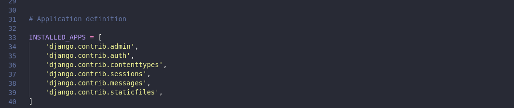

## Configuração do banco de dados

Agora, abra o mysite/settings.py. Ele é um módulo normal do Python com variáveis de módulo representando as configurações do Django.

Por padrão, a configuração usa o SQLite. Se você é novo com banco de dados, ou se estiver somente interessado em experimentar o Django, esta á maneira mais simples. SQLite está incluso no Python, de modo que você não precisa instalar nada a mais para ter o banco de dados. Contudo, quando iniciar seu primeiro projeto real, talvez queira usar um banco de dados mais escalável como o PostgreSQL, para evitar problemas com a troca do banco de dados no caminho.

Se você quiser usar outro banco de dados, instale as ligações de banco de dados apropriadas e altere os seguintes parâmetros no item DATABASES 'default' para corresponder às suas configurações de conexão de banco de dados:

* ENGINE – ou mesmo 'django.db.backends.sqlite3', 'django.db.backends.postgresql', 'django.db.backends.mysql', ou 'django.db.backends.oracle'. Outros backends estão estão disponíveis.

* NAME – O nome do seu banco de dados, se você estiver usando SQLite, o banco de dados será uma arquivo no seu computador; neste caso, NAME deve ser o caminho absoluto, incluindo o nome, para este arquivo. O valor padrão BASE_DIR / 'db.sqlite3', ira criar este arquivo no diretório do seu projeto.
Caso não use o SQLite como banco de dados, configurações adicionais como USER, PASSWORD, e HOST deverão ser adicionadas. Para mais detalhes, veja a referência na documentação para DATABASES.

## Por padrão, o INSTALLED_APPS contém as seguintes aplicações, que vêm com o Django:

django.contrib.admin – O site de administração. Irá usar isso em breve.
django.contrib.auth – Um sistema de autenticação.
django.contrib.contenttypes – Um framework para tipos de conteúdo.
django.contrib.sessions – Um framework de sessão.
django.contrib.messages – Um framework de envio de mensagem.
django.contrib.staticfiles – Um framework para gerenciamento de arquivos estáticos.

Aqui, cada modelo é representado por uma classe derivada da classe `django.db.models.Model`. Cada modelo possui alguns atributos de classe, as quais por sua vez representa um campo do banco de dados no modelo.

Cada campo é representado por uma instância de uma classe Field – por exemplo, CharField para campos do tipo caractere e DateTimeField para data/hora. Isto diz ao Django qual tipo de dado cada campo contém.

O nome de cada instância Field (por exemplo question_text ou pub_date) é o nome do campo, em formato amigável para a máquina. Você irá usar este valor no seu código Python, e seu banco de dados irá usá-lo como nome de coluna.

Você pode usar um argumento opcional na primeira posição de um Field para designar um nome legível para seres humanos o qual será usado em uma série de partes introspectivas do Django, e também servirá como documentação. Se esse argumento não for fornecido, o Django utilizará o nome legível para máquina. Neste exemplo nós definimos um nome legível para humanos apenas para Question.pub_date. Para todos os outros campos neste modelo, o nome legível para máquina será utilizado como nome legível para humanos.

Algumas classes de Field possuem elementos obrigatórios. O CharField, por exemplo, requer que você informe a ele um max_length que é usado não apenas no esquema do banco de dados, mas na validação, como nós veremos em breve.

Um Field pode ter vários argumentos opcionais; neste caso, definimos o valor default de votes para 0.

Finalmente, note que uma relação foi criada, usando ForeignKey. Isso diz ao Django que cada Choice está relacionada a uma única Question. O Django oferece suporte para todos os relacionamentos comuns de um banco de dados: muitos-para-um, muitos-para-muitos e um-para-um.
