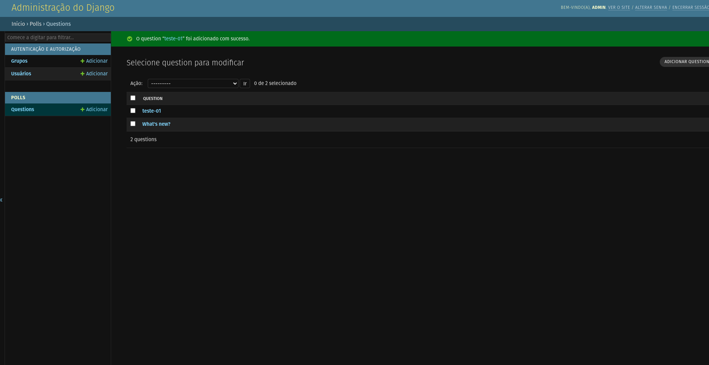

## Configuração do banco de dados

Agora, abra o mysite/settings.py. Ele é um módulo normal do Python com variáveis de módulo representando as configurações do Django.

Por padrão, a configuração usa o SQLite. Se você é novo com banco de dados, ou se estiver somente interessado em experimentar o Django, esta á maneira mais simples. SQLite está incluso no Python, de modo que você não precisa instalar nada a mais para ter o banco de dados. Contudo, quando iniciar seu primeiro projeto real, talvez queira usar um banco de dados mais escalável como o PostgreSQL, para evitar problemas com a troca do banco de dados no caminho.

Se você quiser usar outro banco de dados, instale as ligações de banco de dados apropriadas e altere os seguintes parâmetros no item DATABASES 'default' para corresponder às suas configurações de conexão de banco de dados:

* ENGINE – ou mesmo 'django.db.backends.sqlite3', 'django.db.backends.postgresql', 'django.db.backends.mysql', ou 'django.db.backends.oracle'. Outros backends estão estão disponíveis.

* NAME – O nome do seu banco de dados, se você estiver usando SQLite, o banco de dados será uma arquivo no seu computador; neste caso, NAME deve ser o caminho absoluto, incluindo o nome, para este arquivo. O valor padrão BASE_DIR / 'db.sqlite3', ira criar este arquivo no diretório do seu projeto.
Caso não use o SQLite como banco de dados, configurações adicionais como USER, PASSWORD, e HOST deverão ser adicionadas. Para mais detalhes, veja a referência na documentação para DATABASES.


## Por padrão, o INSTALLED_APPS contém as seguintes aplicações, que vêm com o Django:

django.contrib.admin – O site de administração. Irá usar isso em breve.
django.contrib.auth – Um sistema de autenticação.
django.contrib.contenttypes – Um framework para tipos de conteúdo.
django.contrib.sessions – Um framework de sessão.
django.contrib.messages – Um framework de envio de mensagem.
django.contrib.staticfiles – Um framework para gerenciamento de arquivos estáticos.


Aqui, cada modelo é representado por uma classe derivada da classe `django.db.models.Model`. Cada modelo possui alguns atributos de classe, as quais por sua vez representa um campo do banco de dados no modelo.

Cada campo é representado por uma instância de uma classe Field – por exemplo, CharField para campos do tipo caractere e DateTimeField para data/hora. Isto diz ao Django qual tipo de dado cada campo contém.

O nome de cada instância Field (por exemplo question_text ou pub_date) é o nome do campo, em formato amigável para a máquina. Você irá usar este valor no seu código Python, e seu banco de dados irá usá-lo como nome de coluna.

Você pode usar um argumento opcional na primeira posição de um Field para designar um nome legível para seres humanos o qual será usado em uma série de partes introspectivas do Django, e também servirá como documentação. Se esse argumento não for fornecido, o Django utilizará o nome legível para máquina. Neste exemplo nós definimos um nome legível para humanos apenas para Question.pub_date. Para todos os outros campos neste modelo, o nome legível para máquina será utilizado como nome legível para humanos.

Algumas classes de Field possuem elementos obrigatórios. O CharField, por exemplo, requer que você informe a ele um max_length que é usado não apenas no esquema do banco de dados, mas na validação, como nós veremos em breve.

Um Field pode ter vários argumentos opcionais; neste caso, definimos o valor default de votes para 0.

Finalmente, note que uma relação foi criada, usando ForeignKey. Isso diz ao Django que cada Choice está relacionada a uma única Question. O Django oferece suporte para todos os relacionamentos comuns de um banco de dados: muitos-para-um, muitos-para-muitos e um-para-um.


### ToSring da classe

É importante adicionar métodos __str__() aos seus modelos, não apenas para sua própria conveniência quando estiver lidando com o prompt interativo, mas também porque representações de objetos são usadas por todo interface administrativa gerada automaticamente pelo Django.

Vamos também adicionar um método personalizado a este modelo:

```python
def was_published_recently(self):
	return self.pub_date >= timezone.now() - datetime.timedelta(days=1)

```


```python
>>> from polls.models import Choice, Question

# Make sure our __str__() addition worked.
>>> Question.objects.all()
<QuerySet [<Question: What's up?>]>

# Django provides a rich database lookup API that's entirely driven by
# keyword arguments.
>>> Question.objects.filter(id=1)
<QuerySet [<Question: What's up?>]>
>>> Question.objects.filter(question_text__startswith="What")
<QuerySet [<Question: What's up?>]>

# Get the question that was published this year.
>>> from django.utils import timezone
>>> current_year = timezone.now().year
>>> Question.objects.get(pub_date__year=current_year)
<Question: What's up?>

# Request an ID that doesn't exist, this will raise an exception.
>>> Question.objects.get(id=2)
Traceback (most recent call last):
    ...
DoesNotExist: Question matching query does not exist.

# Lookup by a primary key is the most common case, so Django provides a
# shortcut for primary-key exact lookups.
# The following is identical to Question.objects.get(id=1).
>>> Question.objects.get(pk=1)
<Question: What's up?>

# Make sure our custom method worked.
>>> q = Question.objects.get(pk=1)
>>> q.was_published_recently()
True

# Give the Question a couple of Choices. The create call constructs a new
# Choice object, does the INSERT statement, adds the choice to the set
# of available choices and returns the new Choice object. Django creates
# a set to hold the "other side" of a ForeignKey relation
# (e.g. a question's choice) which can be accessed via the API.
>>> q = Question.objects.get(pk=1)

# Display any choices from the related object set -- none so far.
>>> q.choice_set.all()
<QuerySet []>

# Create three choices.
>>> q.choice_set.create(choice_text="Not much", votes=0)
<Choice: Not much>
>>> q.choice_set.create(choice_text="The sky", votes=0)
<Choice: The sky>
>>> c = q.choice_set.create(choice_text="Just hacking again", votes=0)

# Choice objects have API access to their related Question objects.
>>> c.question
<Question: What's up?>

# And vice versa: Question objects get access to Choice objects.
>>> q.choice_set.all()
<QuerySet [<Choice: Not much>, <Choice: The sky>, <Choice: Just hacking again>]>
>>> q.choice_set.count()
3

# The API automatically follows relationships as far as you need.
# Use double underscores to separate relationships.
# This works as many levels deep as you want; there's no limit.
# Find all Choices for any question whose pub_date is in this year
# (reusing the 'current_year' variable we created above).
>>> Choice.objects.filter(question__pub_date__year=current_year)
<QuerySet [<Choice: Not much>, <Choice: The sky>, <Choice: Just hacking again>]>

# Let's delete one of the choices. Use delete() for that.
>>> c = q.choice_set.filter(choice_text__startswith="Just hacking")
>>> c.delete()
```


### Admin django

Filosofia

Gerar um site de administração para sua equipe ou clientes para adicionar, alterar, e deletar conteúdo é uma tarefa tediosa que não requer muita criatividade. Por essa razão, o Django automatiza totalmente a criação da interface de administração para os modelos.

O Django foi desenvolvido em um ambiente de redação, onde havia uma clara separação entre “produtores de conteúdo” e o site “público”. Gerentes de site usam o sistema para adicionar notícias, eventos, resultado de esportes, etc, e o conteúdo é exibido no site público. O Django soluciona o problema de criar uma interface unificada para os administradores editarem o conteúdo.

A interface de administração não foi desenvolvida necessariamente para ser usada pelos visitantes do site, mas sim pelos gerentes.


## Tornando as Entidades Visíveis no Admin

Para fazer nossos modelos visíveis no site de administração, precisamos dizer ao Django que nosso modelo está registrado. Para fazer isso, edite o arquivo polls/admin.py, que criamos no capítulo anterior, e adicione o seguinte código:

```python
from django.contrib import admin

from .models import Question

admin.site.register(Question)
```

